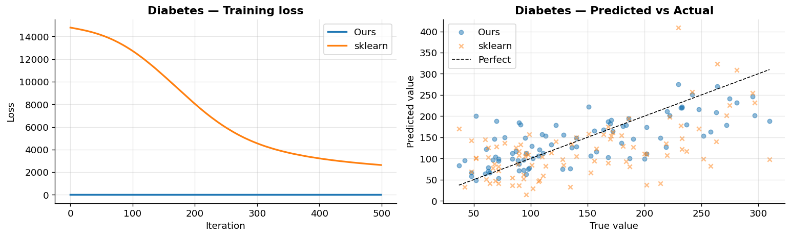
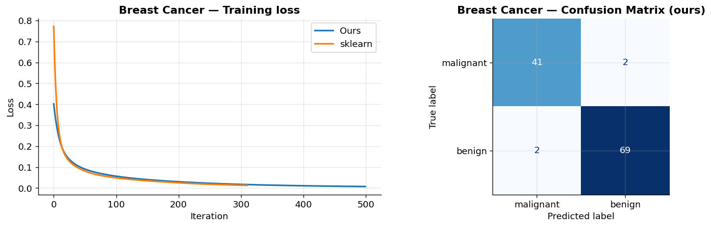
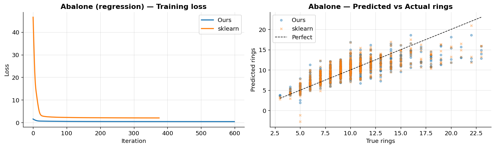
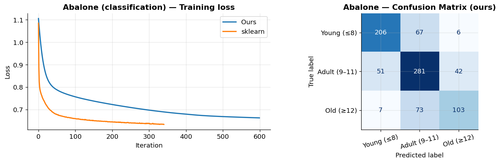

# Neural Network Project
 
Implementation of a single hidden layer neural network from scratch, for both classification and regression. The interface is similar to sklearn's MLPClassifier / MLPRegressor.
 
**Course:** Math for Machine Learning
 
---
 
## What I built
 
Two classes:
- `SimpleSLPClassifier` — for binary and multi-class classification
- `SimpleSLPRegressor` — for regression
Both share the same base class (`BaseSLPEstimator`) which handles weight initialization, the Adam optimizer, and early stopping.
 
The architecture is simple: one hidden layer with a configurable activation function, and an output layer that depends on the task (softmax for classification, linear for regression).
 
I used **Adam** instead of vanilla gradient descent because it converges much faster and doesn't require tuning the learning rate as carefully. For weight initialization I used **Xavier uniform** which works better than small random values, especially with ReLU.
 
For regression, I normalize the targets internally (zero mean, unit variance) so the learning rate works regardless of the scale of y.
 
---
 
## Parameters
 
| Parameter | Default | What it does |
|---|---|---|
| `hidden_layer_size` | 100 | neurons in the hidden layer |
| `activation` | `'logistic'` | `'relu'`, `'tanh'`, or `'logistic'` |
| `learning_rate` | 0.001 | Adam learning rate |
| `max_iter` | 200 | max training iterations |
| `random_state` | None | for reproducibility |
| `tol` | 1e-4 | min improvement to count as progress |
| `n_iter_no_change` | 10 | iterations without progress before stopping early |
 
---
 
## How to run
 
Install dependencies:
```bash
pip install scikit-learn ucimlrepo matplotlib
```
 
Run the tests:
```bash
python -m pytest tests/ -v
```
 
Run the demo (generates all plots):
```bash
python demo.py
```
 
---
 
## Results
 
All experiments use `hidden_layer_size=64`, `activation='relu'`, `learning_rate=0.001`, 80/20 train-test split, features standardized with StandardScaler.
 
### 1. Diabetes (regression)
 
442 patients, 10 features (BMI, blood pressure, etc.), predicting a disease progression score.
 
| Model | R² |
|---|---|
| Ours | **0.5200** |
| sklearn MLP | 0.0306 |
 
sklearn didn't converge in 500 iterations with the same hyperparameters. Our model converges cleanly because of Adam + target normalization.
 

 
---
 
### 2. Breast Cancer (binary classification)
 
569 tumour samples, 30 features, predicting malignant vs benign.
 
| Model | Accuracy |
|---|---|
| Ours | 96.49% |
| sklearn MLP | **97.37%** |
 
Very close results. We get 4 errors out of 114 test samples (2 false positives, 2 false negatives).
 

 
---
 
### 3. Abalone (regression + multi-class)
 
Abalone are sea snails. Normally you'd cut the shell and count rings under a microscope to find their age — this dataset tries to predict that from physical measurements (length, weight, etc.) instead.
 
4177 samples, 8 features (+ one-hot encoding for Sex: M/F/Infant).
 
#### Regression — predict ring count directly
 
| Model | R² |
|---|---|
| Ours | 0.5735 |
| sklearn MLP | **0.5837** |
 
Almost identical, less than 0.01 difference.
 

 
#### Multi-class — predict age group
 
I binned the rings into 3 groups: Young (≤8), Adult (9–11), Old (≥12).
 
| Model | Accuracy |
|---|---|
| Ours | 70.57% |
| sklearn MLP | **71.41%** |
 
Most errors happen between adjacent groups (Adult misclassified as Young or Old), which makes sense since the boundaries are arbitrary.
 

 
---
 
## Summary
 
| Dataset | Task | Ours | sklearn |
|---|---|---|---|
| Diabetes | R² | **0.52** | 0.03 |
| Breast Cancer | Accuracy | 96.5% | **97.4%** |
| Abalone | R² | 0.57 | **0.58** |
| Abalone | Accuracy | 70.6% | **71.4%** |
 
Overall our implementation is very close to sklearn on all datasets. The main gap is that sklearn has more sophisticated internals (adaptive lr, different solvers) but for a from-scratch implementation the results are solid.
 
---
 
## Math summary
 
**Forward pass:**
```
z1 = X @ W1 + b1
a1 = activation(z1)
z2 = a1 @ W2 + b2
y_pred = softmax(z2)        # or identity for regression
```
 
**Backward pass** (cross-entropy + softmax simplifies nicely):
```
δ2 = (y_pred - y) / N
dW2 = a1.T @ δ2
δ1 = (δ2 @ W2.T) * activation'(z1)
dW1 = X.T @ δ1
```
 
**Adam update:**
```
m = β1·m + (1-β1)·g
v = β2·v + (1-β2)·g²
W -= lr · (m / (1-β1^t)) / (√(v / (1-β2^t)) + ε)
```
 